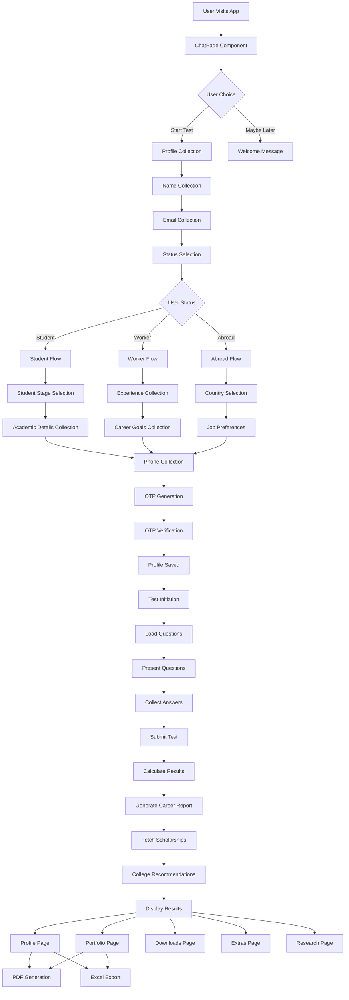

# Career Counselling Web Application - Complete Flow

## Application Architecture Overview

### Frontend (React + TypeScript)

- **Framework**: React 18 with TypeScript
- **Routing**: React Router DOM
- **UI**: Bootstrap 5 + Custom CSS
- **State Management**: React Hooks (useState, useEffect)
- **API Communication**: Axios

### Backend (Node.js + Express)

- **Framework**: Express.js
- **Database**: MongoDB (with in-memory fallback)
- **Authentication**: OTP-based verification
- **File Generation**: PDF (jsPDF) + Excel (xlsx)
- **Storage**: Hybrid (MongoDB + In-memory Maps)

## Complete User Flow

### 1. Initial Landing & Welcome

```
User visits app → ChatPage loads → Welcome message with options
```

### 2. User Registration Flow

```
User clicks "Yes, start the test" →
Collect Name →
Collect Email →
Collect Status (Student/Worker/Abroad Aspirant) →
Branch based on status
```

### 3. Status-Based Profile Collection

#### For Students:

```
Student Stage Selection (12th/UG/PG) →
- 12th: Stream → Academic % → IELTS/SAT → Phone
- UG: Bachelor's Stream → Career Goal → GRE/GMAT → Projects → Phone
- PG: Current Degree → Career Goal → Exams → Phone
```

#### For Working Professionals:

```
Experience Range →
Current Company/Domain →
Career Goal →
Domain Switch Interest →
Target Role/Industry →
Breakout Opportunities →
Phone
```

#### For Abroad Aspirants:

```
Target Country →
Preferred Job Type →
Required Exams/Certifications →
Timeline →
Phone
```

### 4. Authentication Flow

```
Phone Number Entry →
OTP Generation & Sending →
OTP Verification →
Profile Data Saved →
Test Initiation
```

### 5. Psychometric Assessment

```
Load Questions (RIASEC + Multiple Intelligence + Emotional Intelligence) →
Present Questions One by One →
Collect Answers →
Submit Test →
Calculate Career Suggestions
```

### 6. Results & Reports Generation

```
Test Submission →
Career Suggestion Calculation →
Generate Career Report →
Fetch Scholarship Options →
College Recommendations →
Display Results
```

### 7. Portfolio & Downloads

```
View Career Report →
View Portfolio →
Generate PDF →
Generate Excel →
Access Extras →
Research Submission
```

## Technical Flow Diagram



## API Endpoints Flow

### Authentication APIs

- `POST /api/auth/register` - User registration with OTP
- `POST /api/auth/verify-otp` - OTP verification
- `POST /api/auth/update-profile` - Profile data update

### Test APIs

- `GET /api/test/questions` - Fetch psychometric questions
- `POST /api/test/submit` - Submit test answers
- `GET /api/test/results/:userId` - Get test results

### Report APIs

- `GET /api/report/career-guidance/:userId` - Generate career report
- `GET /api/report/scholarships/:userId` - Get scholarship options

### Portfolio APIs

- `GET /api/portfolio/data/:userId` - Get portfolio data
- `GET /api/portfolio/generate/:userId` - Generate PDF

### Export APIs

- `GET /api/export/excel/:userId` - Generate Excel export

## Data Storage Strategy

### In-Memory Storage (Primary)

- `global.userData` - User profiles and verification status
- `global.testResponses` - Test answers and career suggestions

### MongoDB Storage (Secondary)

- Collections: `users`, `testResponses`
- Fallback when in-memory fails
- Persistent storage for production

## Key Components

### Frontend Components

1. **ChatPage** - Main conversational interface
2. **ProfilePage** - Career report display
3. **PortfolioPage** - Portfolio view
4. **DownloadsPage** - File downloads
5. **ExtrasPage** - Additional features
6. **ResearchPage** - Research submission

### Backend Services

1. **Auth Service** - User registration and verification
2. **Test Service** - Psychometric assessment logic
3. **Report Service** - Career guidance generation
4. **PDF Generator** - Portfolio PDF creation
5. **Excel Generator** - Data export functionality

## Assessment Logic

### Question Categories

1. **RIASEC Model** - 6 personality types (Realistic, Investigative, Artistic, Social, Enterprising, Conventional)
2. **Multiple Intelligences** - 8 intelligence types
3. **Emotional Intelligence** - 5 EI components
4. **Legacy Questions** - General career preferences

### Scoring System

- Likert Scale: Strongly Agree (5) to Strongly Disagree (1)
- Category-based aggregation
- Domain recommendation based on highest scores

### Career Suggestions

- **Technology**: Software Developer, Data Scientist, Cybersecurity
- **Creative Arts**: Graphic Designer, Content Creator, UX/UI Designer
- **Business**: Business Analyst, Project Manager, Consultant
- **Social Services**: Counselor, Teacher, Social Worker
- **Research**: Research Analyst, Statistician, Market Researcher

## File Generation

### PDF Generation

- Personal information
- Career assessment results
- Recommended roles and courses
- Next steps and recommendations

### Excel Export

- User profile data
- Test responses
- Career suggestions
- Structured data for analysis

## Navigation Flow

```
ChatPage (/)
├── ProfilePage (/profile/:userId)
├── PortfolioPage (/portfolio/:userId)
├── DownloadsPage (/downloads)
├── ExtrasPage (/extras)
└── ResearchPage (/research)
```

## Error Handling

### Frontend

- Loading states for all async operations
- Error boundaries for component failures
- User-friendly error messages

### Backend

- Try-catch blocks for all operations
- Database connection fallbacks
- Graceful degradation to in-memory storage

## Security Features

### Authentication

- OTP-based verification
- Phone number validation
- Session management

### Data Protection

- Input validation
- SQL injection prevention
- CORS configuration

## Performance Optimizations

### Frontend

- Component lazy loading
- State management optimization
- API call caching

### Backend

- In-memory storage for speed
- Database connection pooling
- Efficient data structures

## Deployment Considerations

### Environment Variables

- Database connection strings
- OTP service configuration
- Port configurations

### Production Setup

- MongoDB connection
- OTP service integration
- File storage configuration
- Security hardening
